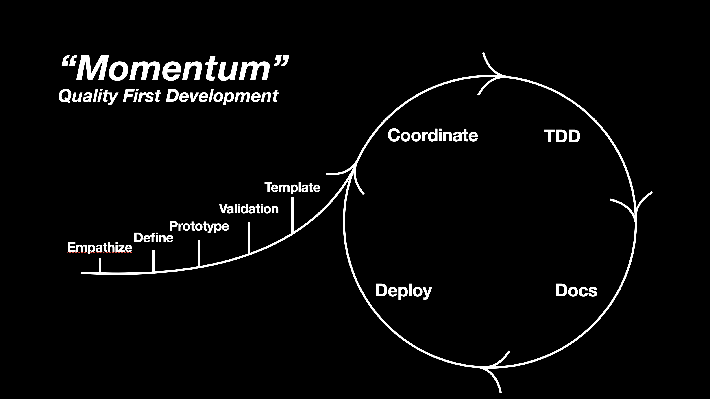
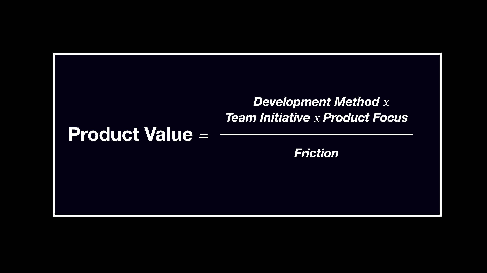

# Momentum

Momentum is a modern software development framework designed for teams, or solo developers, who need a practical way to build the best possible product.

The model takes the best ideas from Scrum, Design Thinking, XP and DevOps, combining it into a more efficient development method.

It centers around the two simplest ideas, when it comes to developing a product:

- Clarity around what needs to be built
- Steady, disciplined execution

We shouldn't treat the different stages of development as isolated parts of development, but as a coherent and logical process, designed for building the right product and then building it right.

## *Momentum* consists of two parts:

**Foundation**

- Empathize
- Define
- Prototype
- Validation
- Template

This is where we build an understanding of the product, whether it exists already or not, sharpen the direction and, most importantly, prepare for the execution. Not only do we find the focus for the product, but we also create meaningful template to ease the workload later on.

**The Flip** - is where direction become practice. Through coordination and testing, documentation and deployment, we ensure that every of an apps development life cycle is treated with the respect and focus it needs for it to withstand tests of time - especially in an era with fast development.

This part of the framework is meant to be iterative, with only one rule: daily iterations.

- Coordinate
- TDD
- Deploy
- Docs

## Why Momentum

A lot of teams struggle, but not because of a lack of effort, but because of inconsistent ways of development with bureaucratic meetings, tiring down the developers and demotivating the personal needs within the team for product success.

The issue can be put down in the following equation:

Product Value is shaped by the right development method, good team initiative and the correct focus. If we have meetings with no real gain, slow development methods or tedious weeks of testing different deployments, we increase friction and thus lower the Product Value.

## How Momentum Fixes This

Momentum connects clarity with execution it into a continous development flow, because the **Foundation** give the team direction and **The Flip** turns the direction into disciplined delivery.

Together, they create a way of working that is lightweight enough to stay practical across all sizes of teams, but structured enough to support quality over time.